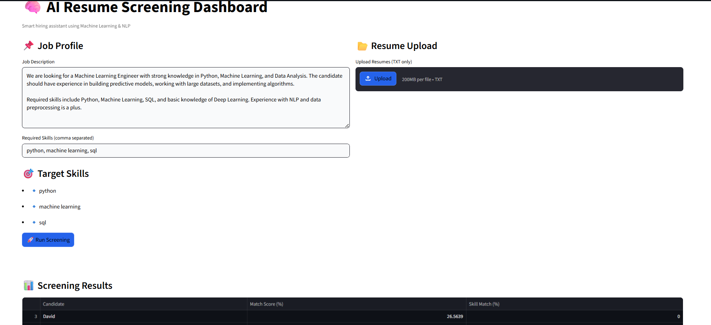

#  AI Resume Screening Dashboard

An AI-powered web application that automates resume screening and ranks candidates based on job description using Machine Learning and Natural Language Processing (NLP).

---

##  Project Overview

Recruiters often spend a lot of time manually reviewing resumes.  
This project simplifies the hiring process by automatically analyzing and ranking resumes based on their relevance to a given job description.

The system predicts:
-  Resume Match Score  
-  Skill Match Percentage  
-  Top Candidate  

---

##  Features

- ✅ Resume ranking using TF-IDF & Cosine Similarity  
- ✅ Skill-based matching system  
- ✅ Upload multiple resumes  
- ✅ Interactive web app using Streamlit  
- ✅ Clean and modern white UI  
- ✅ Real-time analysis and results  

---

## 🛠️ Technologies Used

- Python 🐍  
- Streamlit  
- Pandas  
- Scikit-learn  
- NLP (TF-IDF Vectorizer)  

---

##  Machine Learning Approach

- Convert text into numerical vectors using **TF-IDF**
- Calculate similarity using **Cosine Similarity**
- Rank resumes based on similarity score
- Perform skill matching based on keywords

---

## 📊 Project Demo

### 🔹 Input
- Job Description  
- Required Skills  
- Resume files (.txt)

### 🔹 Output
- Match Score (%)  
- Skill Match (%)  
- Top Candidate  

---

## 📸 Screenshots

### 🖥️ App Interface  


---

## ⚙️ How to Run

```bash
pip install streamlit pandas scikit-learn
streamlit run Resume_System.py
